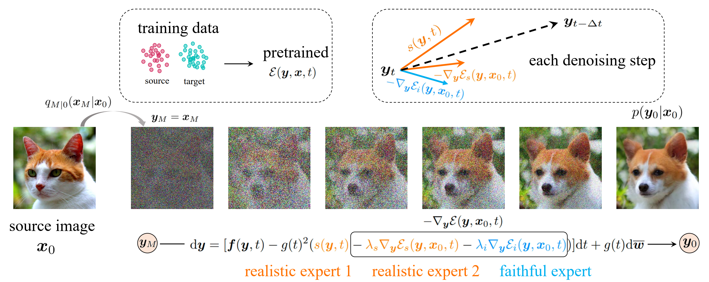
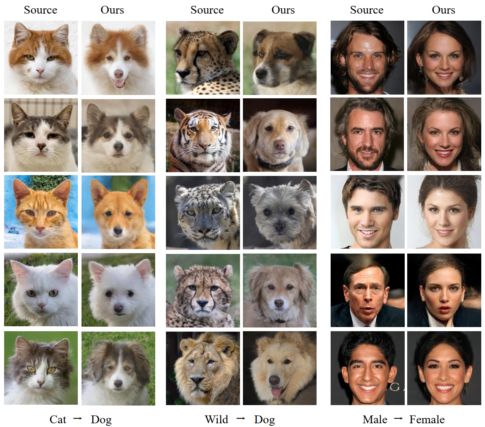
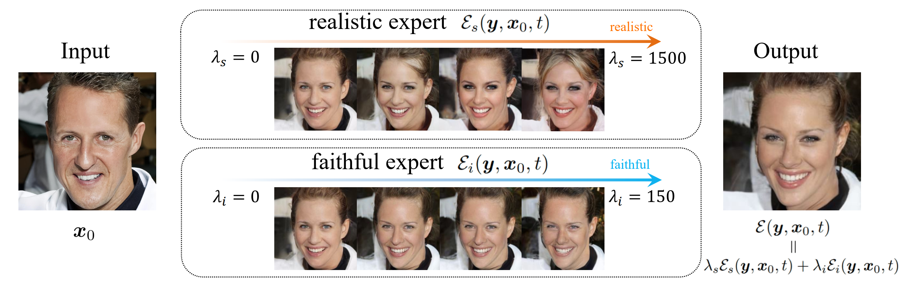
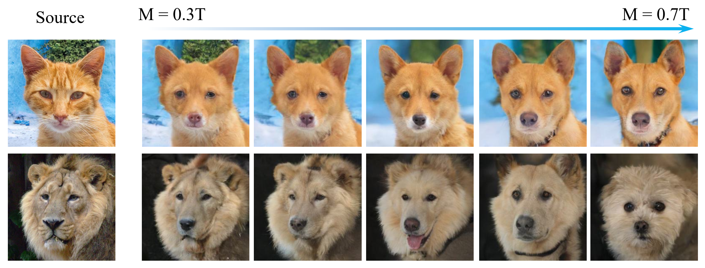

# Energy-Guided Stochastic Differential Equations (EGSDE)
This is the official implementation for [EGSDE: Unpaired Image-to-Image Translation via
Energy-Guided Stochastic Differential Equations](https://arxiv.org/abs/2207.06635)  (Accepted in NIPS 2022).
## Overview
The key idea of EGSDE is to exploit an energy function with domain knowledge 
to guide the inference process of a pretrained SDE for controllable generation.
Existing guidance-based method such as [classifier guidance](https://arxiv.org/abs/2105.05233) can be regarded as a special design of energy
function. In theory, we provide an explanation of the EGSDE as a product of experts.
Experimentally, this paper focuses on unpaired image-to-image translation(I2I) and addresses the problem that existing SDE-based methods ignore the training data in the source domain.
Starting from the noisy source image, EGSDE employs an energy function pretrained on both the source
and target domains to guide the inference process of a pretrained SDE for I2I. The energy function is decomposed into two terms, where one encourages
the transferred image to discard domain-specific features for realism and the other aims to
preserve the domain-independent ones for faithfulness. 
In principle, by defining different energy functions, EGSDE can be applied to other controllable generation tasks such as [inverse molecular design](https://arxiv.org/abs/2209.15408).

## Example Results
### Representative translation results on three unpaired I2I tasks:

### The ablation studies of energy function:

### The ablation studies of initial time M:

## Requirements
pytorch>=1.9.0
## Datasets
Please download the AFHQ and CelebA-HQ dataset following the dataset instructions in https://github.com/clovaai/stargan-v2 and put them in ```data/```. We also provide some demo images in ```data/``` for quick start.
## Pretrained Models
All used pretrained models can be downloaded from [here](https://drive.google.com/drive/folders/1awa0vkcWhd9LIEiS9VtGTwO5hI4WEI3G?usp=sharing). Please put them in ```pretrained_model/```.
## Run EGSDE for Two-Domain Image Translation

```
$ python run_EGSDE.py
```
```task``` is which task to run and is chosen from ```cat2dog/wild2dog/male2female```. The resutls will be saved in runs/```task```. The default args is provided in profiles/```task```.
* ```testdata_path``` is the path for source image. ```ckpt``` is the path for score-based diffusion model. ```dsepath``` is the path for domain-specific extractors.
* ```t``` is the initial time M. ```ls``` and ```li``` is the weight parameters. ```seed``` is the random seed.\
## Run EGSDE for Multi-Domain Image Translation

```
$ python run_EGSDE_multi_domain.py
```

## Evaluation
```
$ python run_score.py
```
```task``` decides which task to evaluation and is chosen from ```cat2dog/wild2dog/male2female```.```translate_path``` is the path of generated images. ```source_path``` is the path of source images. 
```gt_path``` is the path of target domain images. We also provide the FID statistics of female images in CelebA-HQ [here](https://drive.google.com/drive/folders/1awa0vkcWhd9LIEiS9VtGTwO5hI4WEI3G?usp=sharing).

## Training Domain-specific Extractors
```
$ python run_train_dse.py
```
```task``` is which task to run and is chosen from ```cat2dog/wild2dog/male2female/multi_afhq```, where ```multi_afhq``` is to train a multi-class classifier for multi-domain translation. The resutls will be saved in runs/```task```. The default args is provided in profiles/```task```.
```data_path``` is the data path. ```pretrained_model``` is the path of used pretrained classifier provided in [guided-diffusion](https://github.com/openai/guided-diffusion) and we have also uploaded it previous [pretrained model](https://drive.google.com/drive/folders/1awa0vkcWhd9LIEiS9VtGTwO5hI4WEI3G?usp=sharing) link. 

## References
If you find this repository helpful, please cite as:
```
@article{zhao2022egsde,
  title={Egsde: Unpaired image-to-image translation via energy-guided stochastic differential equations},
  author={Zhao, Min and Bao, Fan and Li, Chongxuan and Zhu, Jun},
  journal={arXiv preprint arXiv:2207.06635},
  year={2022}
}
```
This implementation is based on [SDEdit](https://github.com/ermongroup/SDEdit) and [guided-diffusion](https://github.com/openai/guided-diffusion).